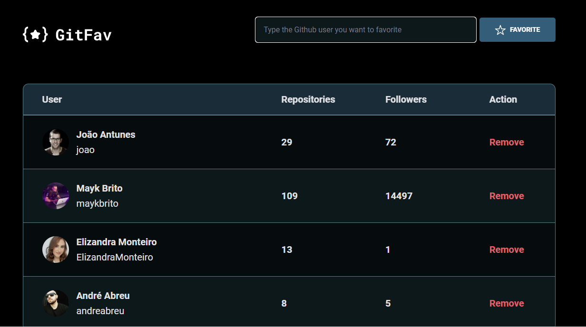

# Desafio GitFav

> Trilha Explorer

One more challenge successfully finished! 

Last challenge of Stage 6 - Rocketseat Explorer trail successfully completed! This is GitFav, where you can favorite Github users and remove them from the list. In it I used the Github API to fetch user information. This challenge addressed:

- Consuming API
- Learning how to create a Screen reader only class
- Object-oriented programming (OOP)
- Classes and Inheritance
- Creating HTML using JavaScript
- The importance of Immutability
- Knowing localStorage
- Static Methods and Promises
- Async Await Promises
- Application flow with Try, Catch and Throw
- Creation of tables in HTML

And let's keep on moving forward!

[🔗 Clique aqui para acessar](https://ElizandraMonteiro.github.io/GitFav/)

## 🛠️ Technologies

- HTML
- CSS
- JavaScript

Made with 💛 Elizandra Monteiro

## 💛 Contact

monteiroelizandra2017@gmail.com